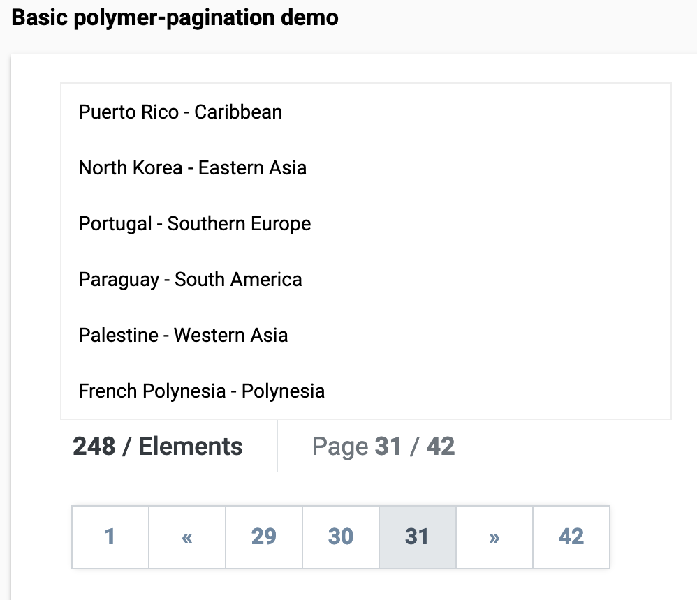

# \<polymer-pagination\>



## Install the Polymer-CLI

First, make sure you have the [Polymer CLI](https://www.npmjs.com/package/polymer-cli) installed. Then run `polymer serve` to serve your element locally.

## Viewing Your Element

```
$ bower install
```

```
$ polymer serve
```

## Running Tests

```
$ polymer test
```

Migration from a great React component pagination by Glad Chinda - [React Pagination Example](https://codesandbox.io/s/l29rokm9rm).
